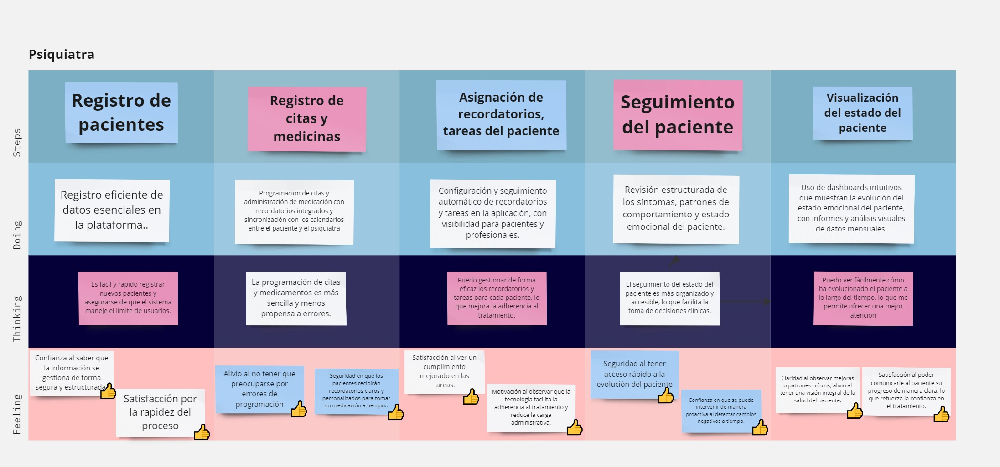
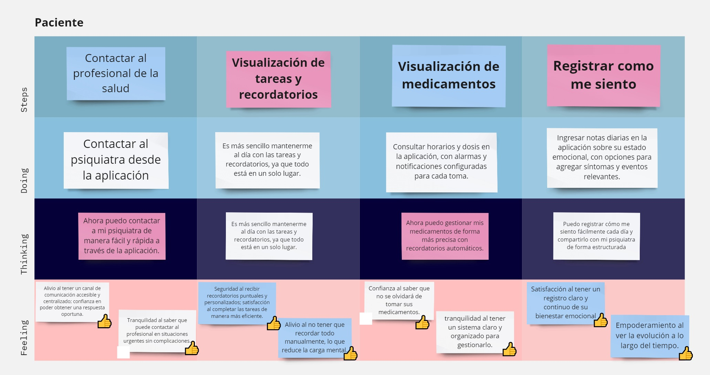

# CAPÍTULO III: Requirements Specifications

## 3.1. To-Be Scenario Mapping.
### Segmento Profesionales:

### Segmento Pacientes:

## 3.2. User Stories.

## Historias de usuario para la aplicación web

US01 - Registro como profesional de la salud mental
<table>
<tr>
<th>Story ID</th>
<th>User</th>
<th>Priority</th>
<th>Epic</th>
</tr>
<tr>
<td>US01</td>
<td>Profesional de la salud mental</td>
<td>8</td>
<td>EP01</td>
</tr>
<tr>
<th colspan="4">Title</th>
</tr>
<tr>
<td colspan="4">Registro como profesional de la salud mental</td>
</tr>
<tr>
<th colspan="4">Description</th>
</tr>
<tr>
<td colspan="4">
Como profesional de la salud mental, quiero registrarme con mis credenciales para poder acceder a las funcionalidades específicas y gestionar la información de mis pacientes.
</td>
</tr>
<tr>
<th colspan="4">Acceptance Criteria</th>
</tr>
<tr>
<td colspan="4">
<ul>
<li><b>Escenario 1: Registro de datos exitoso</b>

Dado que el profesional de la salud mental ha completado todos los campos del formulario de registro,

Cuando hace clic al botón "Crear cuenta",

Entonces la cuenta se crea,

Y el profesional accede a la aplicación con el rol de profesional de la salud mental.</li>
<li><b>Escenario 2: Registro de datos incompleto</b>

Dado que el profesional de la salud mental no ha completado todos los campos del formulario de registro,

Cuando hace clic al botón "Crear cuenta",

Entonces la plataforma muestra un mensaje de error indicando qué campos faltan por completar.</li>
<li><b>Escenario 3: Registro con credenciales ya utilizadas</b>

Dado que el profesional de la salud mental ha completado todos los campos del formulario de registro usando un correo ya registrado,

Cuando hace clic al botón "Crear cuenta",

Entonces la plataforma muestra un mensaje de error indicando que el correo electrónico ya está en uso

Y sugiere recuperar la contraseña.</li>
</ul>
</td>
</tr>
</table>

US02 - Inicio de sesión como paciente
<table>
<tr>
<th>Story ID</th>
<th>User</th>
<th>Priority</th>
<th>Epic</th>
</tr>
<tr>
<td>US02</td>
<td>Paciente</td>
<td>8</td>
<td>EP01</td>
</tr>
<tr>
<th colspan="4">Title</th>
</tr>
<tr>
<td colspan="4">Inicio de sesión como paciente</td>
</tr>
<tr>
<th colspan="4">Description</th>
</tr>
<tr>
<td colspan="4">
Como paciente, quiero iniciar sesión en la plataforma para acceder a mi información personal y seguimiento de tratamiento.
</td>
</tr>
<tr>
<th colspan="4">Acceptance Criteria</th>
</tr>
<tr>
<td colspan="4">
<ul>
<li><b>Escenario 1: Inicio de sesión exitoso</b>

Dado que el paciente ha ingresado su correo electrónico y contraseña correctamente,

Cuando hace clic en un botón de "Iniciar sesión",

Entonces accede a su cuenta

Y es dirigido a su panel de control personal con el rol de paciente.</li>
<li><b>Escenario 2: Contraseña incorrecta</b>

Dado que el paciente ha ingresado su correo y una contraseña incorrecta,

Cuando hace clic en un botón de "Iniciar sesión",

Entonces la plataforma muestra un mensaje de error indicando que la contraseña es incorrecta

Y ofrece la opción de restablecerla.</li>
<li><b>Escenario 3: Recuperación de contraseña</b>

Dado que el paciente ha olvidado su contraseña,

Cuando hace clic en un botón de "Olvidé mi contraseña",

Entonces la plataforma envía un enlace de restablecimiento de contraseña al correo electrónico registrado.</li>
</ul>
</td>
</tr>
</table>

US03 - Inicio de sesión como profesional de la salud mental
<table>
<tr>
<th>Story ID</th>
<th>User</th>
<th>Priority</th>
<th>Epic</th>
</tr>
<tr>
<td>US03</td>
<td>Profesional de la salud mental</td>
<td>8</td>
<td>EP01</td>
</tr>
<tr>
<th colspan="4">Title</th>
</tr>
<tr>
<td colspan="4">Inicio de sesión como profesional de la salud mental</td>
</tr>
<tr>
<th colspan="4">Description</th>
</tr>
<tr>
<td colspan="4">
Como profesional de la salud mental, quiero iniciar sesión en la plataforma para gestionar la información de mis pacientes y acceder a herramientas de seguimiento.
</td>
</tr>
<tr>
<th colspan="4">Acceptance Criteria</th>
</tr>
<tr>
<td colspan="4">
<ul>
<li><b>Escenario 1: Inicio de sesión exitoso</b>

Dado que el profesional de la salud mental ha ingresado su correo electrónico y contraseña correctamente,

Cuando hace clic en un botón de "Iniciar sesión",

Entonces accede a su cuenta

Y es dirigido a su panel de control con acceso a herramientas avanzadas de gestión de pacientes y el rol de profesional de la salud.</li>
<li><b>Escenario 2: Contraseña incorrecta</b>

Dado que el profesional de la salud mental ha ingresado su correo y una contraseña incorrecta,

Cuando hace clic en un botón de "Iniciar sesión",

Entonces la plataforma muestra un mensaje de error indicando que la contraseña es incorrecta

Y ofrece la opción de restablecerla.</li>
<li><b>Escenario 3: Recuperación de contraseña</b>

Dado que el profesional de la salud mental ha olvidado su contraseña,

Cuando hace clic en un botón de "Olvidé mi contraseña",

Entonces la plataforma envía un enlace de restablecimiento de contraseña al correo electrónico registrado.</li>
</ul>
</td>
</tr>
</table>

US04 - Registro de información personal del paciente
<table>
<tr>
<th>Story ID</th>
<th>User</th>
<th>Priority</th>
<th>Epic</th>
</tr>
<tr>
<td>US04</td>
<td>Profesional de la salud mental</td>
<td>5</td>
<td>EP01</td>
</tr>
<tr>
<th colspan="4">Title</th>
</tr>
<tr>
<td colspan="4">Registro de información personal del paciente</td>
</tr>
<tr>
<th colspan="4">Description</th>
</tr>
<tr>
<td colspan="4">
Como profesional de la salud mental, quiero registrar la información personal del paciente para tener una referencia detallada y precisa de sus datos básicos en cada consulta.
</td>
</tr>
<tr>
<th colspan="4">Acceptance Criteria</th>
</tr>
<tr>
<td colspan="4">
<ul>
<li><b>Escenario 1: Registro exitoso de información personal</b>

Dado que el profesional de la salud mental ha ingresado todos los datos del formulario de información personal del paciente,

Cuando hace clic en un botón de "Guardar",

Entonces la información personal del paciente se registra correctamente en la plataforma y está disponible para futuras consultas.</li>
<li><b>Escenario 2: Registro incompleto de información personal</b>

Dado que el profesional de la salud mental no ha ingresado todos los datos del formulario de información personal del paciente,

Cuando hace clic en un botón de "Guardar",

Entonces la plataforma muestra un mensaje de error indicando qué campos faltan por completar.</li>
</ul>
</td>
</tr>
</table>

US05 - Visualización del estado actual de ánimo del paciente
<table>
<tr>
<th>Story ID</th>
<th>User</th>
<th>Priority</th>
<th>Epic</th>
</tr>
<tr>
<td>US05</td>
<td>Profesional de la salud mental</td>
<td>3</td>
<td>EP02</td>
</tr>
<tr>
<th colspan="4">Title</th>
</tr>
<tr>
<td colspan="4">Visualización del estado actual de ánimo del paciente</td>
</tr>
<tr>
<th colspan="4">Description</th>
</tr>
<tr>
<td colspan="4">
Como profesional de la salud mental, quiero visualizar el estado de ánimo actual del paciente para evaluar su condición emocional.
</td>
</tr>
<tr>
<th colspan="4">Acceptance Criteria</th>
</tr>
<tr>
<td colspan="4">
<ul>
<li><b>Escenario 1: Visualización del estado de ánimo</b>

Dado que el profesional de la salud mental ha accedido al perfil del paciente,

Cuando selecciona la opción de visualizar estados de ánimo,

Entonces la plataforma muestra el estado de ánimo del paciente que se registró el mismo día.</li>
<li><b>Escenario 2: Estados de ánimo no registrados</b>

Dado que el profesional de la salud mental ha accedido al perfil del paciente sin haber registrado ningún estado de ánimo del mismo,

Cuando selecciona la opción de visualizar estados de ánimo,

Entonces la plataforma no muestra los datos ingresados.</li>
</ul>
</td>
</tr>
</table>

US06 - Registro de estado de ánimo
<table>
<tr>
<th>Story ID</th>
<th>User</th>
<th>Priority</th>
<th>Epic</th>
</tr>
<tr>
<td>US06</td>
<td>Paciente</td>
<td>5</td>
<td>EP02</td>
</tr>
<tr>
<th colspan="4">Title</th>
</tr>
<tr>
<td colspan="4">Registro de estado de ánimo</td>
</tr>
<tr>
<th colspan="4">Description</th>
</tr>
<tr>
<td colspan="4">
Como paciente, quiero comunicarle a mi profesional mi estado de ánimo para ver mi estado actual.
</td>
</tr>
<tr>
<th colspan="4">Acceptance Criteria</th>
</tr>
<tr>
<td colspan="4">
<ul>
<li><b>Escenario 1: Registro de emoción</b>

Dado que el paciente se encuentra en la sección de registros de estado emocional,

Cuando registra su estado de ánimo actual,

Entonces la plataforma debe actualizar su estado emocional en el perfil del paciente.</li>
<li><b>Escenario 2: Almacenamiento de estado de ánimo</b>

Dado que el paciente se encuentra en la sección de registros de estado emocional,

Y posee un registro con cada uno de los estados que ingresó con anterioridad,

Cuando ingresa al historial de estados de ánimo,

Entonces la plataforma debe mostrar un calendario con los estados del paciente a lo largo del tiempo.</li>
</ul>
</td>
</tr>
</table>

US07 - Registro de funciones biológicas
<table>
<tr>
<th>Story ID</th>
<th>User</th>
<th>Priority</th>
<th>Epic</th>
</tr>
<tr>
<td>US07</td>
<td>Paciente</td>
<td>5</td>
<td>EP02</td>
</tr>
<tr>
<th colspan="4">Title</th>
</tr>
<tr>
<td colspan="4">Registro de funciones biológicas</td>
</tr>
<tr>
<th colspan="4">Description</th>
</tr>
<tr>
<td colspan="4">
Como paciente, quiero registrar la calidad de mis funciones biológicas para que mi profesional conozca mi estado actual de salud.
</td>
</tr>
<tr>
<th colspan="4">Acceptance Criteria</th>
</tr>
<tr>
<td colspan="4">
<ul>
<li><b>Escenario 1: Ingreso de funciones biológicas</b>

Dado que el paciente ha accedido a la sección de registro de funciones biológicas,

Cuando selecciona la opción de registrar funciones,

Entonces la plataforma debe permitir al paciente seleccionar su nivel de sueño, hambre, energía e hidratación en una escala del 1 al 5.</li>
</ul>
</td>
</tr>
</table>

US08 - Registro de medicamentos del paciente
<table>
<tr>
<th>Story ID</th>
<th>User</th>
<th>Priority</th>
<th>Epic</th>
</tr>
<tr>
<td>US08</td>
<td>Profesional de la salud mental</td>
<td>3</td>
<td>EP03</td>
</tr>
<tr>
<th colspan="4">Title</th>
</tr>
<tr>
<td colspan="4">Registro de medicamentos del paciente</td>
</tr>
<tr>
<th colspan="4">Description</th>
</tr>
<tr>
<td colspan="4">
Como profesional de la salud mental, quiero registrar los medicamentos del paciente para seguir adecuadamente su tratamiento farmacológico.
</td>
</tr>
<tr>
<th colspan="4">Acceptance Criteria</th>
</tr>
<tr>
<td colspan="4">
<ul>
<li><b>Escenario 1: Registro exitoso de medicamentos</b>

Dado que el profesional de la salud mental ha ingresado todos los datos de los medicamentos de su paciente,

Cuando hace clic en un botón de "Guardar",

Entonces los datos del medicamento se registran correctamente en el sistema y se asocian al perfil del paciente.</li>
<li><b>Escenario 2: Registro incompleto de medicamentos</b>

Dado que el profesional de la salud mental no ha ingresado todos los datos de los medicamentos de su paciente,

Cuando hace clic en un botón de "Guardar",

Entonces la plataforma muestra un mensaje de error indicando los campos incompletos o incorrectos.</li>
</ul>
</td>
</tr>
</table>

US09 - Ver medicamentos
<table>
<tr>
<th>Story ID</th>
<th>User</th>
<th>Priority</th>
<th>Epic</th>
</tr>
<tr>
<td>US09</td>
<td>Paciente</td>
<td>3</td>
<td>EP03</td>
</tr>
<tr>
<th colspan="4">Title</th>
</tr>
<tr>
<td colspan="4">Ver medicamentos</td>
</tr>
<tr>
<th colspan="4">Description</th>
</tr>
<tr>
<td colspan="4">
Como paciente, quiero poder ver los medicamentos que mi profesional de salud mental ha asignado para poder estar pendiente de cuáles consumir.
</td>
</tr>
<tr>
<th colspan="4">Acceptance Criteria</th>
</tr>
<tr>
<td colspan="4">
<ul>
<li><b>Escenario 1: Visualización de medicamentos</b>

Dado que el paciente entra a la plataforma

Cuando ingresa a la vista de medicamentos

Entonces puede ver todos los medicamentos recetados.</li>
</ul>
</td>
</tr>
</table>

US10 - Creación de citas
<table>
<tr>
<th>Story ID</th>
<th>User</th>
<th>Priority</th>
<th>Epic</th>
</tr>
<tr>
<td>US10</td>
<td>Profesional de la salud</td>
<td>2</td>
<td>EP04</td>
</tr>
<tr>
<th colspan="4">Title</th>
</tr>
<tr>
<td colspan="4">Creación de citas</td>
</tr>
<tr>
<th colspan="4">Description</th>
</tr>
<tr>
<td colspan="4">
Como profesional de la salud, quiero agendar las citas de mis pacientes.
</td>
</tr>
<tr>
<th colspan="4">Acceptance Criteria</th>
</tr>
<tr>
<td colspan="4">
<ul>
<li><b>Escenario 1: Creación de nueva cita</b>

Dado que el profesional de salud entra a la plataforma

Cuando ingresa a la vista de citas sobre el perfil de un paciente

Entonces puede registrar una nueva cita.</li>
</ul>
</td>
</tr>
</table>

US11 - Ver citas médicas
<table>
<tr>
<th>Story ID</th>
<th>User</th>
<th>Priority</th>
<th>Epic</th>
</tr>
<tr>
<td>US11</td>
<td>Paciente</td>
<td>2</td>
<td>EP04</td>
</tr>
<tr>
<th colspan="4">Title</th>
</tr>
<tr>
<td colspan="4">Ver citas médicas</td>
</tr>
<tr>
<th colspan="4">Description</th>
</tr>
<tr>
<td colspan="4">
Como paciente, quiero poder ver las citas médicas programadas para poder saber qué días ir al consultorio del profesional de salud mental.
</td>
</tr>
<tr>
<th colspan="4">Acceptance Criteria</th>
</tr>
<tr>
<td colspan="4">
<ul>
<li><b>Escenario 1: Visualización de citas</b>

Dado que el paciente entra a la plataforma

Cuando ingresa a la vista de citas

Entonces puede ver todas las citas programas y los detalles de hora y fecha.</li>
</ul>
</td>
</tr>
</table>

## Historias de usuario para la aplicación Móvil

US12 - Iniciar Sesión como Paciente
<table>
<tr>
<th>Story ID</th>
<th>User</th>
<th>Priority</th>
<th>Epic</th>
</tr>
<tr>
<td>US12</td>
<td>Paciente</td>
<td>8</td>
<td>EP01</td>
</tr>
<tr>
<th colspan="4">Title</th>
</tr>
<tr>
<td colspan="4">Iniciar Sesión como Paciente en la aplicación móvil</td>
</tr>
<tr>
<th colspan="4">Description</th>
</tr>
<tr>
<td colspan="4">
Como Paciente, quiero poder iniciar sesión con mi usuario y contraseña para acceder a mi información personal y de salud dentro de la aplicación.
</td>
</tr>
<tr>
<th colspan="4">Acceptance Criteria</th>
</tr>
<tr>
<td colspan="4">
<ul>
<li><b>Escenario 1: Inicio de Sesión Exitoso</b>

Dado que el Paciente está en la pantalla de "Bienvenido" e ingresa su Usuario y Contraseña correctos,

Cuando pulsa el botón "Iniciar Sesión",

Entonces el sistema valida las credenciales y el paciente es dirigido a la pantalla principal.</li>
<li><b>Escenario 2: Credenciales Inválidas</b>

Dado que el Paciente ingresa un Usuario o Contraseña incorrectos,

Cuando pulsa el botón "Iniciar Sesión",

Entonces el sistema no permite iniciar sesión

Y muestra un mensaje de error.</li>
<li><b>Escenario 3: Campos Vacíos</b>

Dado que el Paciente deja los campos de Usuario y/o Contraseña vacíos,

Cuando pulsa el botón "Iniciar Sesión",

Entonces el sistema no permite iniciar sesión

Y muestra un mensaje de error indicando qué campos faltan.</li>
</ul>
</td>
</tr>
</table>

US13 - Visualizar Información de Perfil
<table>
<tr>
<th>Story ID</th>
<th>User</th>
<th>Priority</th>
<th>Epic</th>
</tr>
<tr>
<td>US13</td>
<td>Paciente</td>
<td>3</td>
<td>EP01</td>
</tr>
<tr>
<th colspan="4">Title</th>
</tr>
<tr>
<td colspan="4">Visualizar Información de Perfil en la aplicación móvil</td>
</tr>
<tr>
<th colspan="4">Description</th>
</tr>
<tr>
<td colspan="4">
Como Paciente, quiero poder ver mi información personal (Correo Electrónico, Dirección, ID de Paciente y ID de Profesional) en la sección "Mi Perfil" para confirmar que mis datos son correctos.
</td>
</tr>
<tr>
<th colspan="4">Acceptance Criteria</th>
</tr>
<tr>
<td colspan="4">
<ul>
<li><b>Escenario 1: Visualización del Perfil</b>

Dado que estoy en la aplicación y navego a la pestaña "Profile",

Entonces veo mi Nombre completo,

Y veo mi Correo Electrónico asociado,

Y veo mi Dirección,

Y veo mi ID de Paciente y mi ID de Profesional asignados.</li>
</ul>
</td>
</tr>
</table>

US14 - Cerrar Sesión
<table>
<tr>
<th>Story ID</th>
<th>User</th>
<th>Priority</th>
<th>Epic</th>
</tr>
<tr>
<td>US14</td>
<td>Paciente</td>
<td>2</td>
<td>EP01</td>
</tr>
<tr>
<th colspan="4">Title</th>
</tr>
<tr>
<td colspan="4">Cerrar Sesión en la aplicación móvil</td>
</tr>
<tr>
<th colspan="4">Description</th>
</tr>
<tr>
<td colspan="4">
Como Paciente, quiero poder cerrar mi sesión de forma segura desde la pantalla de Mi Perfil para proteger mi privacidad.
</td>
</tr>
<tr>
<th colspan="4">Acceptance Criteria</th>
</tr>
<tr>
<td colspan="4">
<ul>
<li><b>Escenario 1: Cierre de Sesión Exitoso</b>

Dado que estoy en la pantalla "Mi Perfil" he iniciado sesión,

Cuando pulso el botón "Cerrar Sesión",

Entonces la sesión actual se cierra exitosamente,

Y soy redirigido a la pantalla de Inicio de Sesión.</li>
</ul>
</td>
</tr>
</table>

US15 - Registrar Mi Estado de Salud Diario
<table>
<tr>
<th>Story ID</th>
<th>User</th>
<th>Priority</th>
<th>Epic</th>
</tr>
<tr>
<td>US15</td>
<td>Paciente</td>
<td>5</td>
<td>EP02</td>
</tr>
<tr>
<th colspan="4">Title</th>
</tr>
<tr>
<td colspan="4">Registrar Mi Estado de Salud Diario en la aplicación móvil</td>
</tr>
<tr>
<th colspan="4">Description</th>
</tr>
<tr>
<td colspan="4">
Como Paciente, quiero poder registrar mi estado de salud diario (Mood, Hunger, Hydration, Sleep Quality, Energy Level) para llevar un seguimiento de mi bienestar.
</td>
</tr>
<tr>
<th colspan="4">Acceptance Criteria</th>
</tr>
<tr>
<td colspan="4">
<ul>
<li><b>Escenario 1: Registro Exitoso de Datos de Salud</b>

Dado que estoy en la pestaña "Health" y no he completado el registro de hoy,

Cuando selecciono una opción para cada categoría (Mood, Hunger, Hydration, Sleep Quality, Energy Level) y pulso el botón de registro,

Entonces el sistema guarda el registro de ese día,

Y muestra un mensaje de confirmación.</li>
<li><b>Escenario 2: Reintento de Registro del Mismo Día</b>

Dado que ya he completado el registro de mi estado de salud hoy,

Cuando navego a la pestaña "Health",

Entonces veo un mensaje o un botón deshabilitado que indica "Ya registrado hoy", impidiendo un nuevo registro.</li>
</ul>
</td>
</tr>
</table>

US16 - Consultar Mi Lista de Medicamentos
<table>
<tr>
<th>Story ID</th>
<th>User</th>
<th>Priority</th>
<th>Epic</th>
</tr>
<tr>
<td>US16</td>
<td>Paciente</td>
<td>5</td>
<td>EP03</td>
</tr>
<tr>
<th colspan="4">Title</th>
</tr>
<tr>
<td colspan="4">Consultar Mi Lista de Medicamentos en la aplicación móvil</td>
</tr>
<tr>
<th colspan="4">Description</th>
</tr>
<tr>
<td colspan="4">
Como Paciente, quiero poder ver la lista de medicamentos que tengo asignados para conocer el nombre, el motivo, la frecuencia (Intervalo) y la Cantidad de cada uno.
</td>
</tr>
<tr>
<th colspan="4">Acceptance Criteria</th>
</tr>
<tr>
<td colspan="4">
<ul>
<li><b>Escenario 1: Visualización de Medicamentos</b>

Dado que estoy en la pestaña "Medication",

Entonces veo una lista de todos mis medicamentos,

Y para cada medicamento, se muestra el Motivo, el Intervalo, y la Cantidad.</li>
</ul>
</td>
</tr>
</table>

US17 - Ver Próximas Citas
<table>
<tr>
<th>Story ID</th>
<th>User</th>
<th>Priority</th>
<th>Epic</th>
</tr>
<tr>
<td>US17</td>
<td>Paciente</td>
<td>3</td>
<td>EP04</td>
</tr>
<tr>
<th colspan="4">Title</th>
</tr>
<tr>
<td colspan="4">Ver Próximas Citas en la aplicación móvil</td>
</tr>
<tr>
<th colspan="4">Description</th>
</tr>
<tr>
<td colspan="4">
Como Paciente, quiero poder ver una lista de mis citas médicas próximas con sus detalles (fecha, hora, duración y profesional ID) para estar informado y planificar mi asistencia.
</td>
</tr>
<tr>
<th colspan="4">Acceptance Criteria</th>
</tr>
<tr>
<td colspan="4">
<ul>
<li><b>Escenario 1: Visualización de Citas</b>

Dado que estoy en la pestaña de "Appointments",

Entonces veo la sección "Próximas Citas",

Y veo una lista de citas, donde cada una muestra la Fecha, la Hora, la Duración y el Profesional ID.</li>
<li><b>Escenario 2: Identificación de Cita de Hoy</b>

Dado que hay una cita programada para la fecha actual,

Entonces esta cita muestra una etiqueta distintiva con el texto "HOY".</li>
</ul>
</td>
</tr>
</table>

## Historias de Usuario de la Landing Page (US18 - US20)

US18 - Encontrar información del propósito de la aplicación
<table>
<tr>
<th>Story ID</th>
<th>User</th>
<th>Priority</th>
<th>Epic</th>
</tr>
<tr>
<td>US18</td>
<td>Visitante de la Landing Page</td>
<td>1</td>
<td>EP05</td>
</tr>
<tr>
<th colspan="4">Title</th>
</tr>
<tr>
<td colspan="4">Encontrar información del propósito de la aplicación</td>
</tr>
<tr>
<th colspan="4">Description</th>
</tr>
<tr>
<td colspan="4">
Como visitante de la Landing Page, quiero encontrar fácilmente la información que explique el propósito de la aplicación para comprender cómo puede ser útil para mí.
</td>
</tr>
<tr>
<th colspan="4">Acceptance Criteria</th>
</tr>
<tr>
<td colspan="4">
<ul>
<li><b>Escenario 1: Visibilidad del propósito de la aplicación</b>

Dado que el visitante se encuentra en la landing page,

Cuando explora la página principal,

Entonces la landing page debe poseer información clara y concisa sobre el propósito de la aplicación.</li>
</ul>
</td>
</tr>
</table>

US19 - Visualización de imágenes y gráficos relevantes
<table>
<tr>
<th>Story ID</th>
<th>User</th>
<th>Priority</th>
<th>Epic</th>
</tr>
<tr>
<td>US19</td>
<td>Visitante de la Landing Page</td>
<td>1</td>
<td>EP05</td>
</tr>
<tr>
<th colspan="4">Title</th>
</tr>
<tr>
<td colspan="4">Visualización de imágenes y gráficos relevantes</td>
</tr>
<tr>
<th colspan="4">Description</th>
</tr>
<tr>
<td colspan="4">
Como visitante de la Landing Page, quiero que las imágenes y gráficos sean claros y visualmente atractivos para captar mi interés y comprender mejor el contenido.
</td>
</tr>
<tr>
<th colspan="4">Acceptance Criteria</th>
</tr>
<tr>
<td colspan="4">
<ul>
<li><b>Escenario 1: Calidad de las imágenes</b>

Dado que el visitante se encuentra en la landing page,

Cuando explora la página principal,

Entonces la landing page debe presentar imágenes de alta calidad y relevantes que capten la atención del visitante.</li>
<li><b>Escenario 2: Relevancia de los gráficos</b>

Dado que el visitante se encuentra en la landing page,

Cuando se desplaza,

Entonces la landing page debe mostrar gráficos que ayuden al visitante a comprender el contenido.</li>
</ul>
</td>
</tr>
</table>

US20 - Tipografía cómoda y agradable estéticamente
<table>
<tr>
<th>Story ID</th>
<th>User</th>
<th>Priority</th>
<th>Epic</th>
</tr>
<tr>
<td>US20</td>
<td>Visitante de la Landing Page</td>
<td>1</td>
<td>EP05</td>
</tr>
<tr>
<th colspan="4">Title</th>
</tr>
<tr>
<td colspan="4">Tipografía cómoda y agradable estéticamente</td>
</tr>
<tr>
<th colspan="4">Description</th>
</tr>
<tr>
<td colspan="4">
Como visitante de la Landing Page, quiero que la tipografía de la misma sea legible y estéticamente agradable para facilitar la lectura y la navegación.
</td>
</tr>
<tr>
<th colspan="4">Acceptance Criteria</th>
</tr>
<tr>
<td colspan="4">
<ul>
<li><b>Escenario 1: Legibilidad de la tipografía</b>

Dado que el visitante se encuentra en la landing page,

Cuando se desplaza a través de la página principal,

Entonces la landing page debe poseer una tipografía clara y de un tamaño adecuado para facilitar la lectura.</li>
<li><b>Escenario 2: Consistencia en el estilo tipográfico</b>

Dado que el visitante se encuentra en la landing page,

Cuando cambia de sección,

Entonces la landing page debe mostrar un estilo tipográfico consistente para mantener la coherencia visual.</li>
</ul>
</td>
</tr>
</table>

**Spike Stories**

| Story ID | User      | Priority | Epic                           | Title                                                                                                | Description                                                                                                                                                                                                             | Acceptance Criteria                                                                                                                                                                                                                                                                         |
|----------|-----------|----------|--------------------------------|------------------------------------------------------------------------------------------------------|-------------------------------------------------------------------------------------------------------------------------------------------------------------------------------------------------------------------------|---------------------------------------------------------------------------------------------------------------------------------------------------------------------------------------------------------------------------------------------------------------------------------------------|
| SP-01    | Developer | Alta     | Autenticación                  | Investigar bibliotecas de autenticación y manejo de roles                                            | Como desarrollador quiero investigar bibliotecas y frameworks de autenticación (JWT) para determinar cuál es más adecuada para integrar autenticación segura y diferenciación de roles entre pacientes y profesionales. | Dado que se realiza la investigación de bibliotecas de autenticación Cuando se evalúan criterios de compatibilidad, seguridad, persistencia de sesión y soporte multiplataforma Entonces se entrega un documento técnico con la librería recomendada y un prototipo mínimo funcional. |
| SP-02    | Developer | Alta     | Sincronización móvil–backend   | Analizar mecanismos de sincronización de datos entre aplicación móvil y backend                      | Como desarrollador quiero investigar las opciones de sincronización de datos (online/offline) entre la aplicación móvil y el backend para garantizar consistencia de la información clínica y del paciente.             | Dado que se analizan distintas estrategias de sincronización (REST, local) Cuando se evalúan la latencia, seguridad y manejo de errores Entonces se presenta un documento técnico y un prototipo que demuestra la sincronización correcta de datos básicos del usuario.               |
| SP-03    | Developer | Media    | Gestión de información clínica | Definir modelo de datos y herramientas para visualización de estado emocional y funciones biológicas | Como desarrollador quiero definir la estructura de base de datos y las herramientas de visualización adecuadas para representar los estados de ánimo, funciones biológicas y medicamentos del paciente.                 | Dado que se analizan bases de datos SQL Cuando se evalúan criterios de rendimiento, escalabilidad y compatibilidad con el backend Entonces se entrega un esquema de datos propuesto y un prototipo visual básico de los registros del paciente.                                       |
| SP-04    | Developer | Media    | Sistema de citas               | Investigar opciones para la gestión y visualización de citas médicas                                 | Como desarrollador quiero investigar librerías y APIs que faciliten la creación, visualización y sincronización de citas médicas entre paciente y profesional.                                                          | Dado que se prueban distintas herramientas de calendarización Cuando se evalúan sus capacidades de integración, manejo de conflictos y notificaciones Entonces se documenta la opción más viable y se crea un prototipo que demuestre la creación de una cita básica.                 |
| SP-05    | Developer | Baja     | Web App                        | Investigar diseño visual, tipografía y accesibilidad para la Web App                                 | Como desarrollador quiero investigar lineamientos de diseño visual, tipografía y frameworks front-end para crear una Web App atractiva, legible y accesible.                                                            | Dado que se analizan frameworks como Angular Material y TailwindCSS Cuando se evalúan los criterios de legibilidad, contraste, accesibilidad y consistencia visual Entonces se entrega un prototipo de la Web App y una guía de estilos inicial para su implementación.               |

## 3.3. Impact Mapping.
### Segmento profesionales:

### Segmento pacientes:

## 3.4 Product Backlog.

| Order User Story | Título                                                     | Descripción                                                                                                                                                                                       | Story Points (Priority) |
|------------------|------------------------------------------------------------|---------------------------------------------------------------------------------------------------------------------------------------------------------------------------------------------------|-------------------------|
| 1                | Registro como profesional de la salud mental               | Como profesional de la salud mental quiero registrarme con mis credenciales para poder acceder a las funcionalidades específicas y gestionar la información de mis pacientes.                     | 8                       |
| 2                | Inicio de sesión como paciente                             | Como paciente, quiero iniciar sesión en la plataforma para acceder a mi información personal y seguimiento de tratamiento.                                                                        | 8                       |
| 3                | Inicio de sesión como profesional de la salud mental       | Como profesional de la salud mental, quiero iniciar sesión en la plataforma para gestionar la información de mis pacientes y acceder a herramientas de seguimiento.                               | 8                       |
| 4                | Iniciar Sesión como Paciente en la aplicación móvil        | Como Paciente, quiero poder iniciar sesión con mi usuario y contraseña para acceder a mi información personal y de salud dentro de la aplicación.                                                 | 8                       |
| 5                | Registro de información personal del paciente              | Como profesional de la salud mental, quiero registrar la información personal del paciente para tener una referencia detallada y precisa de sus datos básicos en cada consulta.                   | 5                       |
| 6                | Registro de estado de ánimo                                | Como paciente, quiero comunicarle a mi profesional mi estado de ánimo para ver mi estado actual.                                                                                                  | 5                       |
| 7                | Registro de funciones biológicas                           | Como paciente, quiero registrar la calidad de mis funciones biológicas para que mi profesional conozca mi estado actual de salud.                                                                 | 5                       |
| 8                | Registrar Mi Estado de Salud Diario en la aplicación móvil | Como Paciente, quiero poder registrar mi estado de salud diario (Mood, Hunger, Hydration, Sleep Quality, Energy Level) para llevar un seguimiento de mi bienestar.                                | 5                       |
| 9                | Consultar Mi Lista de Medicamentos en la aplicación móvil  | Como Paciente, quiero poder ver la lista de medicamentos que tengo asignados para conocer el nombre, el motivo, la frecuencia (Intervalo) y la Cantidad de cada uno.                              | 5                       |
| 10               | Visualización de el estado actual de ánimo del paciente    | Como profesional de la salud mental, quiero visualizar el estado de ánimo actual del paciente para evaluar su condición emocional.                                                                | 3                       |
| 11               | Registro de medicamentos del paciente                      | Como profesional de la salud mental, quiero registrar los medicamentos del paciente para seguir adecuadamente su tratamiento farmacológico.                                                       | 3                       |
| 12               | Ver medicamentos                                           | Como paciente quiero poder ver los medicamentos que mi profesional de salud mental ha asignado para poder estar pendiente de cuales consumir.                                                     | 3                       |
| 13               | Visualizar Información de Perfil en la aplicación móvil    | Como Paciente, quiero poder ver mi información personal (Correo Electrónico, Dirección, ID de Paciente y ID de Profesional) en la sección "Mi Perfil" para confirmar que mis datos son correctos. | 3                       |
| 14               | Ver Próximas Citas en la aplicación móvil                  | Como Paciente, quiero poder ver una lista de mis citas médicas próximas con sus detalles (fecha, hora, duración y profesional ID) para estar informado y planificar mi asistencia.                | 3                       |
| 15               | Creación de citas                                          | Como profesional de la salud quiero agendar las citas de mis pacientes.                                                                                                                           | 2                       |
| 16               | Ver citas médicas                                          | Como paciente quiero poder ver las citas médicas programadas para poder saber que días ir al consultorio del profesional de salud mental.                                                         | 2                       |
| 17               | Cerrar Sesión en la aplicación móvil                       | Como Paciente, quiero poder cerrar mi sesión de forma segura desde la pantalla de Mi Perfil para proteger mi privacidad.                                                                          | 2                       |
| 18               | Encontrar información del propósito de la aplicación       | Como visitante de la Landing Page, quiero encontrar fácilmente la información que explique el propósito de la aplicación para comprender cómo puede ser útil para mí.                             | 1                       |
| 19               | Visualización de imágenes y gráficos relevantes            | Como visitante de la Landing Page, quiero que las imágenes y gráficos sean claros y visualmente atractivos para captar mi interés y comprender mejor el contenido.                                | 1                       |
| 20               | Tipografía cómoda y agradable estéticamente                | Como visitante de la Landing Page, quiero que la tipografía de la misma sea legible y estéticamente agradable para facilitar la lectura y la navegación.                                          | 1                       |

