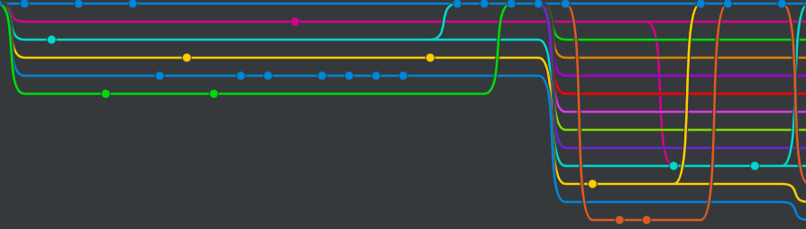
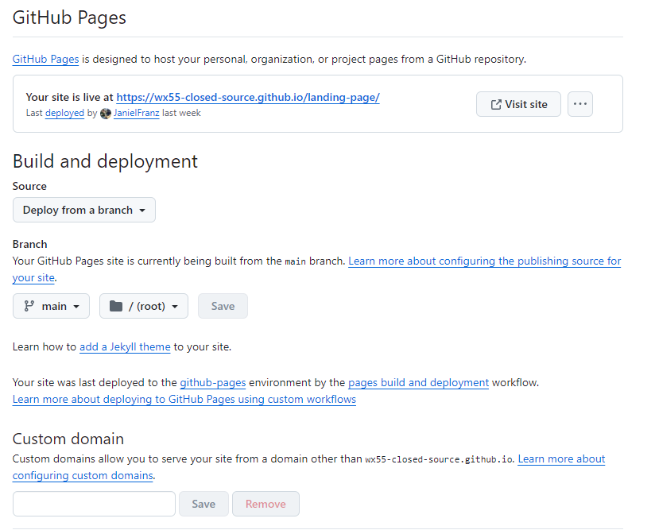

# Capítulo IV: Product Implementation & Validation

# 4. Product Implementation & Validation

## 4.1. Software Configuration Management

En este apartado se describe el proceso mediante el cual se organiza, gestiona y controla la configuración del software y los cambios en el desarrollo del proyecto. El objetivo es garantizar que todos los integrantes del equipo trabajen bajo un mismo entorno, utilizando herramientas estandarizadas y metodologías que aseguren la trazabilidad, la calidad y la colaboración continua.
### 4.1.1 Software Development Environment Configuration.
**Requirements Management**
1.Requirements Management

Trello: Plataforma de gestión de proyectos basada en tableros Kanban. Será utilizada por el equipo de PsyMed para planificar, organizar y hacer seguimiento del trabajo, especialmente bajo metodologías ágiles (Scrum). Permite asignar responsables, definir prioridades y actualizar el estado de cada tarea en tiempo real, lo que mejora la visibilidad del progreso y la coordinación del equipo.

Ruta de referencia: https://trello.com/es

Tableros de la organización: https://trello.com/invite/b/68e438bc12fe9651d240dfe1/ATTIc34f9aa0fa66bc1feb777cef9467dfeeE331B2D7/diseno

**Product UX/UI Design**

1. Figma: Herramienta colaborativa para el diseño de interfaces y prototipado. Se empleará en la construcción de los prototipos de la aplicación, tanto en su versión Desktop como en Mobile Web Browser. Facilita el diseño en equipo y permite iterar rápidamente en el aspecto visual antes del desarrollo.

Ruta de referencia: https://www.figma.com/login

**Software Development**
1. WebStorm: Entorno de desarrollo integrado (IDE) especializado en tecnologías web. Ha sido elegido por su soporte avanzado para HTML, CSS, JavaScript y frameworks como React y Angular. Ofrece herramientas de refactorización, depuración, integración con Git y compatibilidad multiplataforma, lo que optimiza la productividad y estandariza el desarrollo del equipo.

   Ruta de referencia: https://www.jetbrains.com/webstorm/
   <br><br>

2. HTML5: Lenguaje de marcado utilizado para estructurar y presentar el contenido de la aplicación web. Servirá como base para la maquetación de la interfaz.

   Ruta de referencia: https://www.w3schools.com/html/html5_syntax.asp
   <br><br>

3. CSS: Lenguaje de hojas de estilo en cascada para definir la presentación visual del contenido. En conjunto con HTML, permitirá dar estilo, diseño adaptable y coherencia visual a la aplicación.

   Ruta de referencia: https://google.github.io/styleguide/htmlcssguide.html
   <br>
   <br>

4. JavaScript: Lenguaje de programación dinámico y orientado a objetos. Se utilizará para el desarrollo de la lógica de la interfaz y la interacción del usuario con la aplicación.

   Ruta de referencia: https://developer.mozilla.org/es/docs/Web/JavaScript
   <br>
   <br>

5. Angular: Framework de JavaScript escrito en TypeScript. Será la principal tecnología para el desarrollo del front-end del proyecto PsyMed. Permite crear aplicaciones escalables, modulares y mantenibles. El código desarrollado se encuentra alojado en el repositorio correspondiente.

   Ruta de referencia: https://github.com/Diseno-de-experimentos-Grupo-2/psymed-frontend
   <br><br>
6. Android Studio: Entorno de desarrollo integrado (IDE) oficial para el desarrollo de aplicaciones Android. Se utilizará para crear la versión móvil de la aplicación PsyMed, aprovechando sus herramientas de diseño, emulación y depuración específicas para dispositivos Android.

   Ruta de referencia: https://developer.android.com/studio
   <br>
   <br>
7. Flutter: Framework de código abierto desarrollado por Google para la creación de aplicaciones nativas multiplataforma. Se empleará para desarrollar la aplicación móvil de PsyMed, permitiendo compartir una base de código entre Android e iOS, lo que optimiza el tiempo de desarrollo y asegura una experiencia consistente en ambas plataformas. <br> <br>
8. Dart: Lenguaje de programación optimizado para aplicaciones de interfaz de usuario. Será el lenguaje principal utilizado en conjunto con Flutter para desarrollar la lógica y funcionalidad de la aplicación móvil PsyMed.

   Ruta de referencia: https://dart.dev/
   <br>
   <br>
9. Jetpack Compose: Conjunto de herramientas modernas para construir interfaces de usuario nativas en Android. Se utilizará para diseñar y desarrollar la interfaz de la aplicación móvil PsyMed, facilitando la creación de componentes reutilizables y una experiencia de usuario fluida.

   Ruta de referencia: https://developer.android.com/jetpack/compose
   <br>
   <br>
10. Kotlin: Lenguaje de programación moderno y conciso para el desarrollo de aplicaciones Android. Se empleará para complementar el desarrollo de la aplicación móvil PsyMed, aprovechando su interoperabilidad con Java y sus características avanzadas que mejoran la productividad del desarrollador.

   Ruta de referencia: https://kotlinlang.org/
   <br>
   <br>

**Software Deployment**
1. Git: Sistema de control de versiones distribuido. Permitirá a los integrantes del equipo llevar un registro detallado de los cambios, gestionar ramas de desarrollo, y facilitar la integración de nuevas funcionalidades sin comprometer la estabilidad del proyecto.

   Ruta de referencia: https://git-scm.com/
   <br>
   <br>
   **Software Documentation and Project Management**
2. GitHub: Plataforma colaborativa en la nube para el alojamiento de repositorios Git. Será el medio oficial para la centralización del código, revisión de contribuciones y gestión de issues, además de permitir la integración con otras herramientas de desarrollo y CI/CD

   Ruta de referencia: https://github.com/


### 4.1.2. Source Code Management.
El proyecto adoptará las convenciones del modelo GitFlow para la gestión del control de versiones, utilizando GitHub como plataforma principal para alojar y organizar el código. GitFlow es un enfoque estructurado que facilita la colaboración en equipo, la integración de cambios y la gestión de múltiples versiones del software. Este modelo asegura que cada etapa de desarrollo esté debidamente aislada, probada y documentada antes de ser integrada en la rama principal.

A continuación, se detalla cómo se implementará este flujo de trabajo, junto con los enlaces a los repositorios donde se centralizan los entregables principales:

**Repositorio de GitHub:**
- Enlace para acceder a la [organización en GitHub](https://github.com/Diseno-de-experimentos-Grupo-2)
- Enlace para acceder al repositorio de la [Landing Page](https://github.com/Diseno-de-experimentos-Grupo-2/Landing-Page)
- Enlace para acceder al repositorio del [Reporte Final](https://github.com/Diseno-de-experimentos-Grupo-2/psymed-report)
- Enlace para acceder al repositorio del [Frontend Web](https://github.com/Diseno-de-experimentos-Grupo-2/psymed-frontend)
- Enlace para acceder al repositorio del [Frontend Móvil](https://github.com/Diseno-de-experimentos-Grupo-2/psymed-mobile-flutter)

**Flujo de trabajo GitFlow**

El flujo de trabajo se basará en el modelo propuesto por Vincent Driessen en "A successful Git branching model".



**Estructura de branches (Ramas):**


1. **Master branch (Rama principal):** Contendrá únicamente versiones estables y listas para producción. Los cambios que lleguen aquí deberán haber pasado por pruebas y validaciones en develop y feature branches.

2. **Develop Branch (Rama de Desarrollo):** Funciona como la rama de integración, donde se combinan y prueban las nuevas funcionalidades antes de ser promovidas a master. Garantiza que el código en desarrollo se mantenga operativo y estable.

3. **Feature branch (Ramas de funcionalidad):** Cada nueva característica o mejora se desarrollará en una rama independiente creada a partir de develop. Una vez finalizada y probada, se fusionará nuevamente en develop.

Convención de nombres: feature/nombre-descriptivo.
Ejemplo: feature/bc-medication-management.

### 4.1.3. Source Code Style Guide & Conventions.
**HTML:** Para garantizar un código legible, mantenible y coherente, se seguirán las siguientes prácticas y guías de estilo:

1. Cerrar todos los elementos HTML: Por ejemplo, ```<p>Esto es un párrafo.</p>```
2. Siempre declarar el tipo de documento en la primera línea del documento, para
   HTML es "<!DOCTYPE html>”.
3. Escribir en una línea los comentarios cortos.
4. Utilizar comillas en caso de que los atributos contengan espacios entre sí.
5. Procurar especificar el texto alt y las dimensiones width y height de las imágenes, ya que de esta manera se facilitará la
   disponibilidad del contenido. Por ejemplo:   ``````
6. Se nos recomienda no usar el espacio al momento de utilizar los signos porque
   es más fácil de leerlo de esta forma.  
   <br>
   HTML: (https://www.w3schools.com/html/html5_syntax.asp)

**CSS:** Entre las prácticas empleadas se menciona:

1. Usar sangría de 2 espacios, evitando tabulaciones.
2. Escribir el código en minúsculas.
3. Eliminar espacios en blanco innecesarios.
4. Documentar el código mediante comentarios.
5. Utilizar nombres de clase descriptivos y significativos.
   <br>

   CSS: (https://google.github.io/styleguide/htmlcssguide.html)


### 4.1.4. Software Deployment Configuration.

### Landing page deployment:
Para el despliegue de la Landing Page se utilizará GitHub Pages, siguiendo los pasos descritos a continuación:

1. Colocar los archivos de la página en la raíz del repositorio.
2. Nombrar los archivos de acuerdo a las convenciones: "index.html" para la landing page, "styles.css" para los estilos, "main.js" para los scripts, y una carpeta llamada "assets/images" para las imágenes.
3. Subir los archivos al repositorio mediante un commit.
4. Ir a Settings > Pages y seleccionar el branch main.
5. Definir la carpeta raíz (root) como fuente de la página.
6. Esperar que GitHub realice las validaciones necesarias.
7. Acceder al enlace generado para visualizar la página desplegada.

## GithubPages


Una vez completado el despliegue, la landing page quedará publicada y accesible públicamente mediante el enlace: https://wx55-closed-source.github.io/landing-page/

## 4.2. Landing Page & Mobile Application Implementation
### 4.2.1. Sprint n
#### 4.2.1.1. Sprint Planning 1

<table>
  <tr>
    <th>Sprint #</th>
    <td>Sprint 1</td>
  </tr>
  <tr>
    <th>Sprint Planning Background</th>
    <td>Implementación inicial de la plataforma PsyMed para profesionales de la salud mental y pacientes.</td>
  </tr>
  <tr>
    <th>Date</th>
    <td>2025-11-08</td>
  </tr>
  <tr>
    <th>Time</th>
    <td>10:00 AM</td>
  </tr>
  <tr>
    <th>Location</th>
    <td>Reunión virtual vía Discord</td>
  </tr>
  <tr>
    <th>Prepared By</th>
    <td>Maita Falckenheiner, Romina Guadalupe</td>
  </tr>
  <tr>
    <th>Attendees</th>
    <td>Torres Flores, Paolo Alessandro</td>
  </tr>
  <tr>
    <th>Sprint 1 – 1 Review Summary</th>
    <td>No aplica — este es el Sprint inicial del proyecto PsyMed.</td>
  </tr>
  <tr>
    <th>Sprint 1 – 1 Retrospective Summary</th>
    <td>No aplica — no existen iteraciones anteriores.</td>
  </tr>
  <tr>
    <th>Sprint Goal &amp; User Stories</th>
    <td></td>
  </tr>
  <tr>
    <th>Sprint 1 Goal</th>
    <td>
      <strong>Nuestro enfoque está en</strong> entregar la primera versión funcional de la plataforma PsyMed, que permita la conexión entre profesionales de la salud mental y sus pacientes para una gestión eficiente de las terapias.<br>
      <strong>Creemos que esto ofrece</strong> una mejora en la comunicación, el seguimiento de tratamientos y la gestión de citas en un entorno seguro y accesible para profesionales de la salud mental y pacientes.<br>
      <strong>Esto se confirmará cuando</strong> los usuarios puedan registrarse, agendar sesiones y hacer seguimiento de su progreso terapéutico dentro de la plataforma móvil, con funcionamiento estable en los módulos principales.
    </td>
  </tr>
  <tr>
    <th>Sprint 1 - Velocity</th>
    <td>Estimado en 30 Story Points, enfocado en entregar el MVP con funcionalidades de backend, frontend y autenticación.</td>
  </tr>
  <tr>
    <th>Sprint 1 - Story Points</th>
    <td>30 Story Points distribuidos en 20 User Stories, incluyendo registro, inicio de sesión, gestión de pacientes, programación de citas, control de estado y visualización de tareas.</td>
  </tr>
</table>

#### 4.2.1.2. Sprint Backlog 1

#### 4.2.1.3. Development Evidence for Sprint Review
#### 4.2.1.4. Testing Suite Evidence for Sprint Review
#### 4.2.1.5. Execution Evidence for Sprint Review
#### 4.2.1.6. Services Documentation Evidence for Sprint Review
#### 4.2.1.7. Software Deployment Evidence for Sprint Review
#### 4.2.1.8. Team Collaboration Insights during Sprint
## 4.3. Validation Interviews
### 4.3.1. Diseño de Entrevistas
### 4.3.2. Registro de Entrevistas
### 4.3.3. Evaluaciones según heurísticas

# Conclusiones
### Conclusiones y recomendaciones.
### Video App Validation
### Video About the product
### Video About the team
### Glosario
### Bibliografía
### Anexos