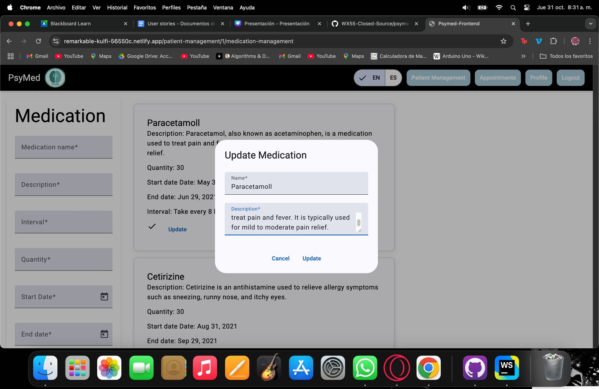

# Capítulo V: Product Implementation, Validation & Deployment

## 5.1 Software Configuration Management
En este apartado se describe el proceso mediante el cual se organiza, gestiona y controla la configuración del software y los cambios en el desarrollo del proyecto. El objetivo es garantizar que todos los integrantes del equipo trabajen bajo un mismo entorno, utilizando herramientas estandarizadas y metodologías que aseguren la trazabilidad, la calidad y la colaboración continua.
### 5.1.1. Software Development Environment Configuration.
**Requirements Management**
1.Requirements Management

Trello: Plataforma de gestión de proyectos basada en tableros Kanban. Será utilizada por el equipo de PsyMed para planificar, organizar y hacer seguimiento del trabajo, especialmente bajo metodologías ágiles (Scrum). Permite asignar responsables, definir prioridades y actualizar el estado de cada tarea en tiempo real, lo que mejora la visibilidad del progreso y la coordinación del equipo.

Ruta de referencia: https://trello.com/es

Tableros de la organización: https://trello.com/invite/b/68e438bc12fe9651d240dfe1/ATTIc34f9aa0fa66bc1feb777cef9467dfeeE331B2D7/diseno


**Product UX/UI Design**

1. Figma: Herramienta colaborativa para el diseño de interfaces y prototipado. Se empleará en la construcción de los prototipos de la aplicación, tanto en su versión Desktop como en Mobile Web Browser. Facilita el diseño en equipo y permite iterar rápidamente en el aspecto visual antes del desarrollo.

Ruta de referencia: https://www.figma.com/login

**Software Development**
1. WebStorm: Entorno de desarrollo integrado (IDE) especializado en tecnologías web. Ha sido elegido por su soporte avanzado para HTML, CSS, JavaScript y frameworks como React y Angular. Ofrece herramientas de refactorización, depuración, integración con Git y compatibilidad multiplataforma, lo que optimiza la productividad y estandariza el desarrollo del equipo.
   
   Ruta de referencia: https://www.jetbrains.com/webstorm/
   <br>

2. HTML5: Lenguaje de marcado utilizado para estructurar y presentar el contenido de la aplicación web. Servirá como base para la maquetación de la interfaz.
   
   Ruta de referencia: https://www.w3schools.com/html/html5_syntax.asp 
   <br>

3. CSS: Lenguaje de hojas de estilo en cascada para definir la presentación visual del contenido. En conjunto con HTML, permitirá dar estilo, diseño adaptable y coherencia visual a la aplicación.
   
   Ruta de referencia: https://google.github.io/styleguide/htmlcssguide.html
   <br>
   <br>

4. JavaScript: Lenguaje de programación dinámico y orientado a objetos. Se utilizará para el desarrollo de la lógica de la interfaz y la interacción del usuario con la aplicación.
   
   Ruta de referencia: https://developer.mozilla.org/es/docs/Web/JavaScript
   <br>
   <br>

5. Angular: Framework de JavaScript escrito en TypeScript. Será la principal tecnología para el desarrollo del front-end del proyecto PsyMed. Permite crear aplicaciones escalables, modulares y mantenibles. El código desarrollado se encuentra alojado en el repositorio correspondiente.
   
   Ruta de referencia: https://github.com/Diseno-de-experimentos-Grupo-2/psymed-frontend

 <br>

**Software Deployment**
1. Git: Sistema de control de versiones distribuido. Permitirá a los integrantes del equipo llevar un registro detallado de los cambios, gestionar ramas de desarrollo, y facilitar la integración de nuevas funcionalidades sin comprometer la estabilidad del proyecto.
   
   Ruta de referencia: https://git-scm.com/
   <br>
   <br>
   **Software Documentation and Project Management**
2. GitHub: Plataforma colaborativa en la nube para el alojamiento de repositorios Git. Será el medio oficial para la centralización del código, revisión de contribuciones y gestión de issues, además de permitir la integración con otras herramientas de desarrollo y CI/CD
   
   Ruta de referencia: https://github.com/


### 5.1.2. Source Code Management.
El proyecto adoptará las convenciones del modelo GitFlow para la gestión del control de versiones, utilizando GitHub como plataforma principal para alojar y organizar el código. GitFlow es un enfoque estructurado que facilita la colaboración en equipo, la integración de cambios y la gestión de múltiples versiones del software. Este modelo asegura que cada etapa de desarrollo esté debidamente aislada, probada y documentada antes de ser integrada en la rama principal.

A continuación, se detalla cómo se implementará este flujo de trabajo, junto con los enlaces a los repositorios donde se centralizan los entregables principales:

**Repositorio de GitHub:**
- Enlace para acceder a la [organización en GitHub](https://github.com/Diseno-de-experimentos-Grupo-2)
- Enlace para acceder al repositorio de la [Landing Page](https://github.com/Diseno-de-experimentos-Grupo-2/Landing-Page)
- Enlace para acceder al repositorio del [Reporte Final](https://github.com/Diseno-de-experimentos-Grupo-2/psymed-report)
- Enlace para acceder al repositorio del [Frontend Web](https://github.com/Diseno-de-experimentos-Grupo-2/psymed-frontend)
- Enlace para acceder al repositorio del [Frontend Móvil](https://github.com/Diseno-de-experimentos-Grupo-2/psymed-mobile-flutter)

**Flujo de trabajo GitFlow**

El flujo de trabajo se basará en el modelo propuesto por Vincent Driessen en "A successful Git branching model".


**Estructura de branches (Ramas):**


1. **Master branch (Rama principal):** Contendrá únicamente versiones estables y listas para producción. Los cambios que lleguen aquí deberán haber pasado por pruebas y validaciones en develop y feature branches.

2. **Develop Branch (Rama de Desarrollo):** Funciona como la rama de integración, donde se combinan y prueban las nuevas funcionalidades antes de ser promovidas a master. Garantiza que el código en desarrollo se mantenga operativo y estable.

3. **Feature branch (Ramas de funcionalidad):** Cada nueva característica o mejora se desarrollará en una rama independiente creada a partir de develop. Una vez finalizada y probada, se fusionará nuevamente en develop.

Convención de nombres: feature/nombre-descriptivo.
Ejemplo: feature/bc-medication-management.

### 5.1.3. Source Code Style Guide & Conventions.
**HTML:** Para garantizar un código legible, mantenible y coherente, se seguirán las siguientes prácticas y guías de estilo:

1. Cerrar todos los elementos HTML: Por ejemplo, ```<p>Esto es un párrafo.</p>```
2. Siempre declarar el tipo de documento en la primera línea del documento, para
   HTML es "<!DOCTYPE html>”.
3. Escribir en una línea los comentarios cortos.
4. Utilizar comillas en caso de que los atributos contengan espacios entre sí.
5. Procurar especificar el texto alt y las dimensiones width y height de las imágenes, ya que de esta manera se facilitará la
   disponibilidad del contenido. Por ejemplo:   ``````
6. Se nos recomienda no usar el espacio al momento de utilizar los signos porque
   es más fácil de leerlo de esta forma.  
   <br>
   HTML: (https://www.w3schools.com/html/html5_syntax.asp)

**CSS:** Entre las prácticas empleadas se menciona:

1. Usar sangría de 2 espacios, evitando tabulaciones.
2. Escribir el código en minúsculas.
3. Eliminar espacios en blanco innecesarios.
4. Documentar el código mediante comentarios.
5. Utilizar nombres de clase descriptivos y significativos. 
   <br>

   CSS: (https://google.github.io/styleguide/htmlcssguide.html)


### 5.1.4. Software Deployment Configuration.
### Landing page deployment:
Para el despliegue de la Landing Page se utilizará GitHub Pages, siguiendo los pasos descritos a continuación:

1. Colocar los archivos de la página en la raíz del repositorio.
2. Nombrar los archivos de acuerdo a las convenciones: "index.html" para la landing page, "styles.css" para los estilos, "main.js" para los scripts, y una carpeta llamada "assets/images" para las imágenes.
3. Subir los archivos al repositorio mediante un commit.
4. Ir a Settings > Pages y seleccionar el branch main.
5. Definir la carpeta raíz (root) como fuente de la página.
6. Esperar que GitHub realice las validaciones necesarias.
7. Acceder al enlace generado para visualizar la página desplegada.

## GithubPages


Una vez completado el despliegue, la landing page quedará publicada y accesible públicamente mediante el enlace: https://wx55-closed-source.github.io/landing-page/

## 5.2. Product Implementation & Deployment

### 5.2.1. Sprint 1

### 5.2.1.2. Sprint Backlog 1

**Sprint 1 — Estado: DONE**  
**Miembros:** Paolo, Romina, Marco, Fátima

---

## Resumen
**Duración estimada:** 2 semanas  
**Objetivo del sprint:** Implementar el flujo completo de autenticación, registro de usuarios (paciente y profesional), registro de datos clínicos y visualización básica de información en la aplicación web y móvil.

---

## User Stories Completadas

| Nº | Título                                                         | Descripción                                                                     | Story Points | Responsable | Estado |
|----|----------------------------------------------------------------|---------------------------------------------------------------------------------|--------------|-------------|--------|
| 1  | Registro como profesional de la salud mental                   | Registro con credenciales para acceder a funcionalidades y gestionar pacientes. | 8            | Paolo       | DONE   |
| 2  | Inicio de sesión como paciente                                 | Autenticación del paciente y acceso a su información personal y de tratamiento. | 8            | Romina      | DONE   |
| 3  | Inicio de sesión como profesional de la salud mental           | Autenticación del profesional para gestionar datos de pacientes.                | 8            | Paolo       | DONE   |
| 4  | Iniciar sesión como Paciente en la app móvil                   | Login móvil con usuario y contraseña.                                           | 8            | Fátima      | DONE   |
| 5  | Registro de información personal del paciente                  | Ingreso de datos personales del paciente.                                       | 5            | Marco       | DONE   |
| 6  | Registro de estado de ánimo                                    | Registro de estado emocional del paciente.                                      | 5            | Romina      | DONE   |
| 7  | Registro de funciones biológicas                               | Registro de calidad de sueño, hambre, hidratación, etc.                         | 5            | Marco       | DONE   |
| 8  | Registrar estado de salud diario (móvil)                       | Registro diario del estado físico y emocional del paciente.                     | 5            | Fátima      | DONE   |
| 9  | Consultar lista de medicamentos (móvil)                        | Visualización de medicamentos asignados.                                        | 5            | Romina      | DONE   |
| 10 | Visualización del estado de ánimo del paciente                 | Profesional visualiza el estado emocional del paciente.                         | 3            | Paolo       | DONE   |
| 11 | Registro de medicamentos del paciente                          | Asignación de medicamentos por parte del profesional.                           | 3            | Marco       | DONE   |
| 12 | Ver medicamentos                                               | Paciente visualiza medicamentos asignados.                                      | 3            | Fátima      | DONE   |
| 13 | Visualizar información de perfil (móvil)                       | Visualización de datos de perfil del paciente.                                  | 3            | Romina      | DONE   |
| 14 | Ver próximas citas (móvil)                                     | Listado de próximas citas médicas.                                              | 3            | Marco       | DONE   |
| 15 | Creación de citas                                              | Profesional agenda citas con pacientes.                                         | 2            | Paolo       | DONE   |
| 16 | Ver citas médicas                                              | Paciente consulta sus citas programadas.                                        | 2            | Fátima      | DONE   |
| 17 | Cerrar sesión (móvil)                                          | Logout seguro desde la app.                                                     | 2            | Romina      | DONE   |
| 18 | Información del propósito de la aplicación (Landing Page)      | Sección explicativa sobre la utilidad del sistema.                              | 1            | Fátima      | DONE   |
| 19 | Visualización de imágenes y gráficos relevantes (Landing Page) | Diseño visual atractivo con gráficos informativos.                              | 1            | Marco       | DONE   |
| 20 | Tipografía cómoda y estética (Landing Page)                    | Tipografía legible y estética para visitantes.                                  | 1            | Paolo       | DONE   |

---

## Totales
- **Total de historias:** 20
- **Total de Story Points:** 77
- **Velocidad del equipo:** 77 pts/sprint
- **Estado general:** 100% completado


### 5.2.1.2. Implmented Landing Page Evidence.

La Landing Page fue hecho deploy a través de GitHub Pages, y se puede acceder a travéz de este enlace: https://diseno-de-experimentos-grupo-2.github.io/Landing-Page/


### 5.2.1.3. Implemented Frontend-Web Application Evidence.

El Frontend-Web se hizo deploy a través de , y se puede acceder desde el siguiente enlace: 


Paciente: 


Profesional:




### 5.2.1.4. Implemented RESTful API and Severless Backend Evidence.


### 5.2.1.6. RESTful API documentation.
Enlace al repositorio del Backend:https://github.com/Diseno-de-experimentos-Grupo-2/psymed-backend

Enlace del Backend deployment: https://psymed-production.up.railway.app

| **Endpoint**                                 | **Método** | **Descripción**                                    | **Parámetros**                      | **Respuesta**                                         | **Ejemplo**                                              |
|----------------------------------------------|------------|----------------------------------------------------|------------------------------------|--------------------------------------------------------|----------------------------------------------------------|
| `/api/v1/professional-profiles`              | POST       | Create a new professional profile                  | JSON Body - `CreateProfessionalProfileResource` | `201 Created` - Profile created<br>`400 Bad Request` - Invalid input | `{"name": "Dr. John Doe", "specialty": "Psychiatrist"}` |
| `/api/v1/professional-profiles/{profileId}`  | GET        | Retrieve a professional profile by its ID          | `{profileId} (Long)`               | `200 OK` - Profile found<br>`404 Not Found` - Profile not found | `{"id": 1, "name": "Dr. John Doe", "specialty": "Psychiatrist"}` |
| `/api/v1/patient-profiles`                     | POST       | Create a new patient profile                       | JSON Body - `CreatePatientProfileResource` | `201 Created` - Profile created<br>`400 Bad Request` - Invalid input | `{"name": "Jane Doe", "age": 30, "diagnosis": "Anxiety"}` |
| `/api/v1/patient-profiles/{profileId}`         | GET        | Retrieve a patient profile by its ID               | `{profileId} (Long)`               | `200 OK` - Profile found<br>`404 Not Found` - Profile not found | `{"id": 1, "name": "Jane Doe", "age": 30, "diagnosis": "Anxiety"}` |
| `/api/v1/patient-profiles`                     | GET        | Retrieve all patient profiles                      | N/A                                | `200 OK` - List of profiles                                | `[{"id": 1, "name": "Jane Doe"}, {"id": 2, "name": "John Doe"}]` |
| `/api/v1/patients/{patientId}/mood-states`               | POST       | Create a new mood state record for a patient            | `patientId (Long)`<br>JSON Body - `CreateMoodStateRecordResource` | `201 Created` - Mood state created<br>`400 Bad Request` - Invalid input | `{"date": "2024-11-17", "mood": "Happy", "notes": "Feeling great today!"}` |
| `/api/v1/patients/{patientId}/mood-states`               | GET        | Retrieve all mood states for a specific patient         | `patientId (Long)`                         | `200 OK` - List of mood states<br>`404 Not Found` - Patient not found  | `[{"id": 1, "date": "2024-11-17", "mood": "Happy", "notes": "Feeling great today!"}]` |
| `/api/v1/patients/{patientId}/biological-functions`       | POST       | Create a new biological function record for a patient     | `patientId (Long)`<br>JSON Body - `CreateBiologicalFunctionRecordResource` | `201 Created` - Biological function created<br>`400 Bad Request` - Invalid input | `{"date": "2024-11-17", "type": "Sleep", "value": "7 hours", "notes": "Slept well"}` |
| `/api/v1/patients/{patientId}/biological-functions`       | GET        | Retrieve all biological function records for a specific patient | `patientId (Long)`                         | `200 OK` - List of biological functions<br>`404 Not Found` - Patient not found  | `[{"id": 1, "date": "2024-11-17", "type": "Sleep", "value": "7 hours"}]` |
| `/api/v1/pills`                | POST        | Create a new medication                                 | JSON Body - `CreatePillResource`      | `201 Created` - Medication created<br>`400 Bad Request` - Invalid input<br>`404 Not Found` - Medication not found | `{"name": "Aspirin", "dosage": "500mg", "instructions": "Take one daily"}` |
| `/api/v1/pills`                | GET         | Retrieve all medications                                | N/A                                   | `200 OK` - List of medications<br>`404 Not Found` - No medications found    | `[{"id": 1, "name": "Aspirin", "dosage": "500mg"}]`       |
| `/api/v1/pills/{pillId}`       | DELETE      | Delete a medication by its ID                           | `pillId (Long)`                       | `200 OK` - Medication deleted<br>`404 Not Found` - Medication not found     | N/A                                                      |
| `/api/v1/accounts/{accountId}`       | GET        | Retrieve account details by account ID       | `accountId (Long)`           | `200 OK` - Account found<br>`404 Not Found` - Account not found | `{"id": 1, "username": "johndoe", "email": "johndoe@example.com"}` |
| `/api/v1/authentication/sign-in`         | POST       | Authenticate a user and generate a token               | JSON Body - `SignInResource`         | `200 OK` - User authenticated<br>`404 Not Found` - Invalid credentials | `{"username": "johndoe", "password": "password123"}`      |
| `/api/v1/authentication/sign-up`         | POST       | Register a new user account                            | JSON Body - `SignUpResource`         | `201 Created` - Account created<br>`400 Bad Request` - Invalid input | `{"username": "janedoe", "email": "janedoe@example.com", "password": "securePass!"}` |

---

### 5.2.1.7. Team Collaboration Insights.

Front-end Web Application: 


Back-end Web Application:


Mobile Application: 


### 5.2.4. Acuerdo SAAS

# Términos de Uso del Servicio SaaS

**Última actualización:** Octubre 2025  
**Jurisdicción aplicable:** Perú  

Estos Términos de Uso regulan el acceso y utilización de la plataforma de salud mental (“la Plataforma”), disponible en versión web y aplicación móvil, que conecta a **profesionales de la salud mental** y **pacientes** para el registro, seguimiento y gestión de información clínica y de bienestar emocional.

---

## 1. Aceptación de los Términos
Al registrarse o acceder a la Plataforma, el usuario (ya sea **profesional de la salud mental** o **paciente**) acepta cumplir con estos Términos de Uso y con las políticas complementarias, incluyendo la Política de Privacidad y el Aviso de Tratamiento de Datos Personales.

---

## 2. Naturaleza del Servicio
La Plataforma es un **Software como Servicio (SaaS)** que permite:
- El registro y autenticación segura de usuarios (pacientes y profesionales).  
- El registro, visualización y gestión de información personal y médica.  
- El seguimiento diario del estado emocional y de salud del paciente.  
- La programación, visualización y gestión de citas médicas.  
- La comunicación clínica entre profesional y paciente a través de funcionalidades internas.

El servicio **no sustituye la atención médica presencial** ni constituye diagnóstico clínico automatizado.

---

## 3. Registro y Autenticación
- Los **profesionales** deben registrarse con credenciales verificables (número de colegiatura o documento equivalente).  
- Los **pacientes** deben registrarse con datos personales válidos y mantener su cuenta actualizada.  
- Cada usuario es responsable de la **confidencialidad de sus credenciales** y del uso de su cuenta.  
- El uso indebido, falsificación de identidad o acceso no autorizado constituye violación de los presentes términos.

---

## 4. Uso Aceptable
Los usuarios deben:
- Utilizar la Plataforma exclusivamente con fines clínicos, terapéuticos o de seguimiento personal autorizados.  
- Abstenerse de compartir, divulgar o manipular información médica sin consentimiento.  
- No alterar, copiar, revender ni intentar obtener el código fuente del sistema.  
- No usar la Plataforma para actividades fraudulentas o que contravengan la ley peruana o normas sanitarias vigentes.

---

## 5. Datos Personales y Confidencialidad
- Toda la información médica, emocional y personal registrada es **confidencial** y tratada conforme a la **Ley N.º 29733 - Ley de Protección de Datos Personales (Perú)**.  
- El proveedor del servicio actúa como **encargado del tratamiento**, y los profesionales como **responsables del tratamiento** en relación con los datos de sus pacientes.  
- Los datos pueden ser almacenados en servidores en la nube dentro o fuera del país, garantizando estándares internacionales de seguridad (cifrado, control de acceso y anonimización).  

---

## 6. Funcionalidades Clave
1. **Autenticación Segura:** Implementación de OAuth2/JWT y cifrado SSL/TLS.  
2. **Registro de Pacientes:** Almacenamiento de datos personales y clínicos básicos.  
3. **Seguimiento Diario:** Registro de estado emocional, calidad del sueño, energía y hábitos biológicos.  
4. **Gestión de Medicación:** Asignación y visualización de medicamentos prescritos.  
5. **Sistema de Citas:** Creación, visualización y recordatorios de citas entre profesional y paciente.  
6. **Perfil de Usuario:** Acceso a información personal, profesional y de conexión terapéutica.  

---

## 7. Propiedad Intelectual
Todos los derechos sobre el software, interfaz, base de datos, diseño, logotipos y contenido generado por el sistema pertenecen al **proveedor de la Plataforma**.  
El usuario conserva los derechos sobre los datos que registra, pero otorga licencia limitada para su procesamiento dentro del sistema.

---

## 8. Responsabilidad
- El proveedor no garantiza la ausencia total de errores ni interrupciones en el servicio, pero se compromete a mantener una **disponibilidad mínima del 95% mensual**.  
- No se asume responsabilidad por decisiones clínicas tomadas fuera del contexto profesional.  
- El uso indebido por parte del usuario o el incumplimiento de los términos libera al proveedor de toda responsabilidad.

---

## 9. Suspensión y Terminación
La cuenta puede ser suspendida o eliminada si:
- Se detecta uso indebido, acceso no autorizado o vulneración de seguridad.  
- Se incumplen las obligaciones establecidas en estos Términos.  
- A solicitud del usuario o de autoridad competente.

---

## 10. Modificaciones
El proveedor podrá modificar estos Términos previa notificación dentro de la Plataforma.  
La continuidad del uso implica aceptación de las actualizaciones.

---

## 11. Legislación Aplicable y Jurisdicción
Estos Términos se rigen por la legislación peruana.  
Cualquier controversia será resuelta ante los tribunales competentes del distrito judicial de Lima Metropolitana.

---

## 12. Contacto
Para consultas o solicitudes relacionadas con los Términos de Uso:  
**Correo:** soporte@plataformasaludmental.pe  
**Teléfono:** +51 1 999 888 777  
**Representante Legal:** Dirección Técnica del Proveedor SaaS de Salud Mental

---

**© 2025 Plataforma SaaS de Salud Mental — Todos los derechos reservados**

